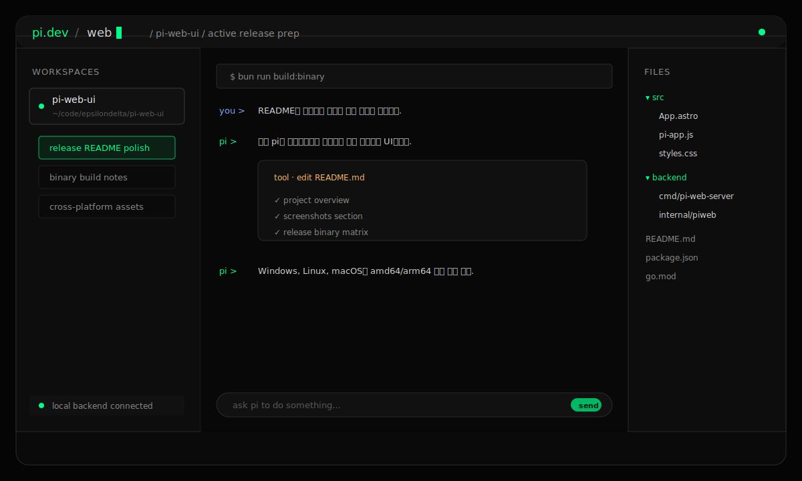
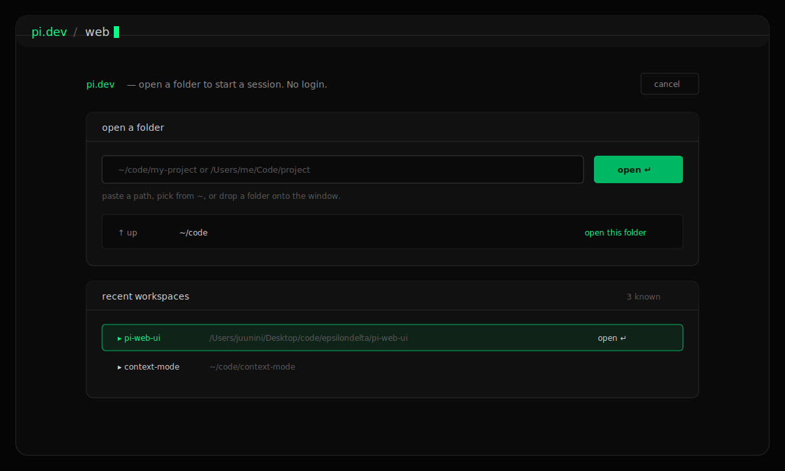
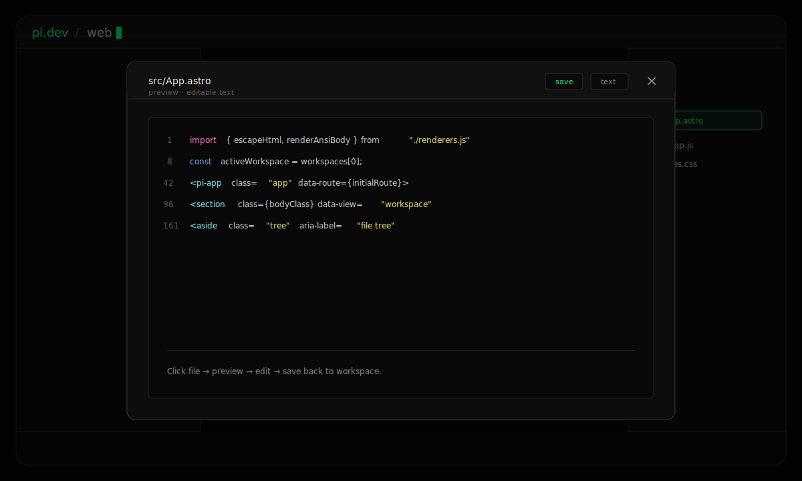

# pi-web-ui

브라우저에서 로컬 `pi` 코딩 에이전트를 보고 조작하는 웹 UI입니다.
Astro 기반 프론트엔드와 Go 백엔드를 하나의 실행 파일로 묶어, 별도 서버 구성 없이 로컬 브라우저에서 workspace/session UI를 실행합니다.

> 상태: v1.0.0 릴리스 준비 중. `pi` 실행 자체는 로컬 머신에 설치된 `pi` CLI를 사용합니다.

## Screenshots

릴리스 전 실제 캡처 이미지로 교체하기 쉽도록 `docs/screenshots/*` 경로를 사용합니다.
현재 이미지는 README 미리보기를 위한 SVG 화면 예시입니다.

| Workspace | Workspace Picker |
| --- | --- |
|  |  |

| File Preview |
| --- |
|  |

## Features

- **Workspace 관리**: 로컬 폴더 열기, 최근 workspace 목록, git clone 후 열기.
- **Session UI**: 기존 pi session 탐색, 새 session 생성, 실시간 prompt/response 스트리밍.
- **파일 탐색/미리보기**: workspace file tree, 파일 읽기/수정/저장 UI.
- **로컬 명령 실행**: 선택한 workspace에서 shell command 실행.
- **단일 실행 파일**: Astro 정적 빌드를 Go 바이너리에 embed해서 배포.
- **Mock backend**: pi CLI 없이 UI/API/SSE 동작을 확인하는 mock mode 제공.

## Requirements

개발/빌드용:

- Bun `>= 1.3.0`
- Node.js `>= 22.0.0`
- Go `>= 1.26`

실행용:

- `pi-web` 실행 파일
- 실제 pi session 실행을 원하면 로컬 `pi` CLI 설치 필요

## Quick Start

개발 서버:

```bash
bun install
bun run dev
```

백엔드:

```bash
bun run backend
# http://127.0.0.1:8732
```

pi CLI 없이 mock streaming으로 실행:

```bash
bun run backend:mock
```

## Build

프론트엔드만 빌드:

```bash
bun run build
```

Astro UI를 Go 백엔드에 embed한 단일 실행 파일 빌드:

```bash
bun run build:binary
./dist/pi-web
# open http://127.0.0.1:8732
```

기본 주소는 `127.0.0.1:8732`입니다. 실행 시 옵션으로 바꿀 수 있습니다.

```bash
./dist/pi-web -host 127.0.0.1 -port 8732
./dist/pi-web -mock
```

## Release Assets

v1.0.0 릴리스에서는 아래 실행 파일을 배포할 계획입니다.

| OS | Arch | Asset |
| --- | --- | --- |
| Windows | amd64 | `pi-web_1.0.0_windows_amd64.zip` |
| Windows | arm64 | `pi-web_1.0.0_windows_arm64.zip` |
| Linux | amd64 | `pi-web_1.0.0_linux_amd64.tar.gz` |
| Linux | arm64 | `pi-web_1.0.0_linux_arm64.tar.gz` |
| macOS | amd64 | `pi-web_1.0.0_darwin_amd64.tar.gz` |
| macOS | arm64 | `pi-web_1.0.0_darwin_arm64.tar.gz` |

다운로드 후 실행:

```bash
# macOS / Linux
chmod +x pi-web
./pi-web

# Windows PowerShell
.\pi-web.exe
```

## Test / Check

```bash
bun run test
bun run backend:test
bun run check
```

`bun run check`는 프론트엔드 테스트, Go 테스트, Astro 빌드, Storybook 빌드를 모두 실행합니다.

## Storybook

```bash
bun run storybook
bun run build-storybook
```

주요 story:

- `Workspace`
- `WorkspacePicker`
- `EmptySession`
- `DisconnectedCompaction`
- `SidebarCollapsed`
- `WithFileTree`

## Project Structure

```text
backend/cmd/pi-web-server      Go entrypoint, embedded static assets
backend/internal/piweb         API server, workspace/session store, runner, SSE broker
src/App.astro                  Main Astro shell
src/pi-app.js                  Browser custom element controller
src/pi-app/*                   UI behavior modules
src/renderers.js               Safe inline markup/render helpers
src/styles.css                 App styles
src/design-system/*            Colors and type tokens
.storybook/pi-fixtures.js      Storybook fixture data
```

## Notes

- 서버는 기본적으로 로컬 바인딩(`127.0.0.1`)을 사용합니다.
- 실제 prompt 실행은 로컬 `pi` CLI에 위임합니다.
- 릴리스용 스크린샷은 `docs/screenshots/*.svg`를 실제 PNG/WebP 캡처로 교체하면 됩니다.
