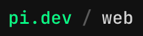
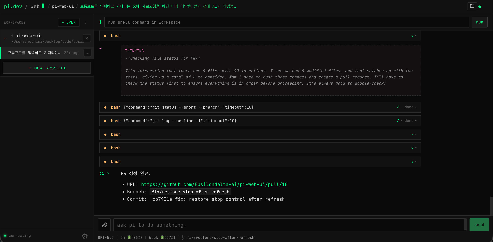
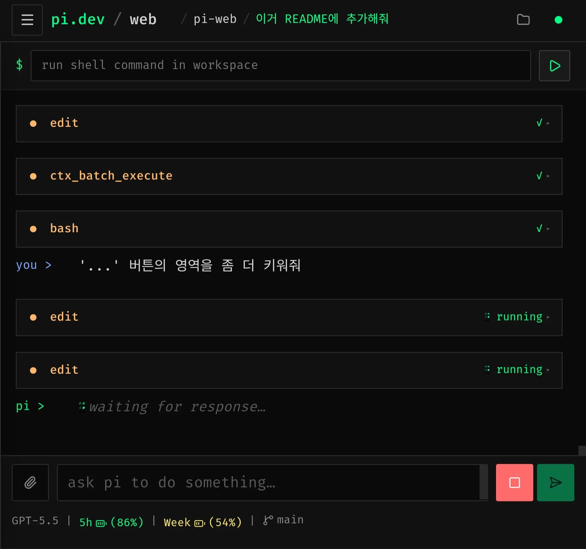
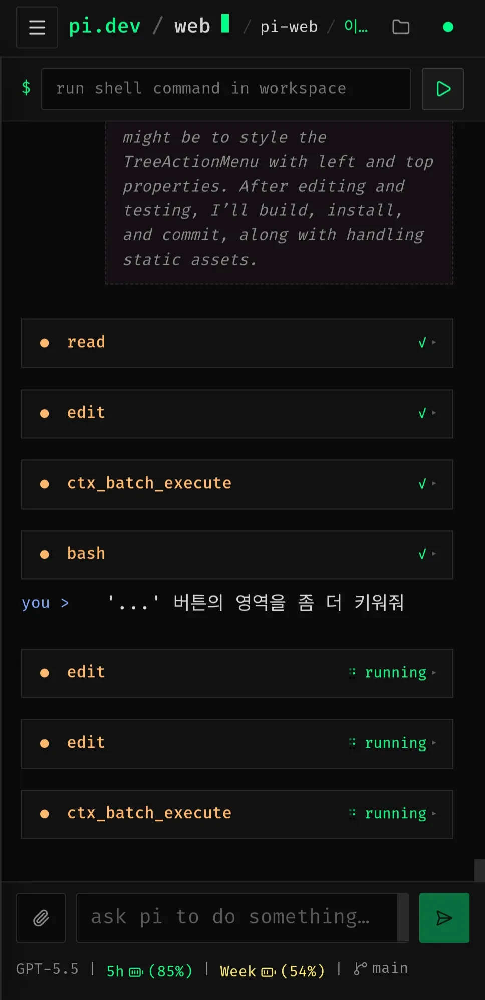

<h1 align="center">pi-web</h1>

<div align="center">

[English](../../README.md) | [한국어](README.ko.md) | [简体中文](README.zh-CN.md) | [日本語](README.ja.md) | [Español](README.es.md) | [Português (BR)](README.pt-BR.md) | [Français](README.fr.md) | [Русский](README.ru.md) | [Deutsch](README.de.md)



| デスクトップ |
| --- |
|  |

| タブレット | モバイル |
| --- | --- |
|  |  |

</div>

## インストール

最新の GitHub Release バイナリをインストールします。

```bash
curl -fsSL https://raw.githubusercontent.com/Epsilondelta-ai/pi-web/main/scripts/install.sh | sh
```

インストーラーは既定の信頼済みプラグイン（toast 通知、ファイルブラウザー、Git ビューアー）もインストールします。スキップするには `PI_WEB_INSTALL_DEFAULT_PLUGINS=never` を設定します。

インストール済みバイナリを更新します。

```bash
pi-web update
```

インストール後に実行します。

```bash
pi-web
# 0.0.0.0:8732 で待ち受けます。http://127.0.0.1:8732 を開いてください

pi-web --port 9999
# http://127.0.0.1:9999 を開いてください
```

## 概要

ブラウザーでローカルの `pi` コーディングエージェントを表示・操作するための Web UI です。
Astro ベースのフロントエンドと Go バックエンドを単一の実行ファイルにまとめているため、別サーバーを設定せずにローカルブラウザーでワークスペース/セッション UI を実行できます。

## 機能

- **ワークスペース管理**: ローカルフォルダーを開き、最近使ったワークスペースを切り替え、保存済みワークスペースを削除し、Git リポジトリをクローンしてから開けます。
- **セッション UI**: ワークスペースのセッションを参照し、セッションの作成/名前変更/削除、過去の会話の再開、プロンプト/応答のリアルタイムストリーミングができます。
- **プロンプト操作**: 複数添付付きのプロンプト送信、セッション別ドラフト保持、実行中タスクのキャンセルや steer、pi fallback choice プロンプトへのインライン回答ができます。
- **トランスクリプト描画**: Markdown、シンタックスハイライト付きコード、ツール出力、ストリーミング design deck、長いトランスクリプトを仮想化して描画します。
- **ファイル閲覧と編集**: Material Icon Theme アイコン付きのワークスペースファイルツリー、ファイル検索、対応形式のプレビュー、ファイルの作成/名前変更/削除/アップロード、テキストファイルの編集と保存を UI で行えます。
- **Git インサイト**: ワークスペースの Git 状態、ファイル装飾、コミット履歴、個別コミット詳細を確認できます。
- **ローカルコマンド実行**: 選択したワークスペースでシェルコマンドを実行し、コマンド履歴と結果を確認できます。
- **設定と認証**: プロジェクト/グローバル pi 設定、API キー、Claude/Codex/Copilot サブスクリプション用 OAuth ログイン、ランタイムモデル/思考設定、quota/status チェックを管理できます。
- **音声と通知**: 応答の読み上げ、ブラウザーまたはローカル Whisper による音声文字起こし、Discord/Telegram 完了通知の設定ができます。
- **国際化 UI**: ブラウザー UI を英語、韓国語、中国語、日本語、スペイン語、ポルトガル語、フランス語、ロシア語、ドイツ語に切り替えられます。
- **AG-UI ブリッジ**: クライアント統合向けに、AG-UI 互換の SSE エンドポイントでセッション実行を公開します。
- **プラグイン（開発中）**: 信頼できるローカル/GitHub JavaScript プラグインで UI パネルを追加し、pi-web API またはローカルバックエンドスクリプトを呼び出せます。
- **単一実行ファイル**: Astro の静的ビルドを Go バイナリに埋め込んで配布し、組み込み更新をサポートします。

## プラグイン（開発中）

プラグインは実験的機能であり、信頼できるローカルコード向けです。安定機能として扱われるまでは API が変更される可能性があります。

**Settings → Plugins** からローカルフォルダのパスまたは GitHub の `owner/repo` でインストールします。プラグインフォルダには `plugin.json` と entry JavaScript モジュールが必要です。

```json
{
  "id": "hello-panel",
  "name": "Hello Panel",
  "version": "0.1.0",
  "entry": "index.js",
  "backend": "backend.js"
}
```

`entry` は必須、`backend` は任意です。どちらのパスもプラグインフォルダ内に収まる必要があります。

```js
export function activate(context) {
  const panel = document.createElement("section");
  panel.dataset.pluginPanel = context.plugin.id;
  panel.textContent = `Hello from ${context.plugin.name}`;
  context.app.querySelector("[data-plugin-sidebar]")?.append(panel);

  return () => {
    panel.remove();
  };
}
```

entry モジュールは `activate(context)` または `default(context)` を export します。関数、または `deactivate()`/`dispose()` を持つオブジェクトを返すと、reload、disable、uninstall 時にクリーンアップされます。モジュールレベルの `deactivate(context)` もサポートします。

プラグイン context:

- `context.app`: `<pi-app>` 要素。
- `context.plugin`: パース済みマニフェスト。
- `context.api.get(path)` / `context.api.post(path, body)`: pi-web HTTP API の呼び出し。
- `context.backend(method, { workspaceId, data })`: 任意のバックエンド呼び出し。`data` が stdin JSON です。

任意の backend スクリプトはローカルで必要に応じて実行されます。JavaScript は Node、Go は自動ビルド/キャッシュです。スクリプトは `method` と `workspaceRoot` 引数を受け取り、stdin から JSON を読み、stdout に有効な JSON を出力する必要があります。

```js
const [, , method, workspaceRoot] = process.argv;
let input = "";
process.stdin.on("data", (chunk) => {
  input += chunk;
});
process.stdin.on("end", () => {
  console.log(JSON.stringify({ method, workspaceRoot, received: JSON.parse(input || "{}") }));
});
```
